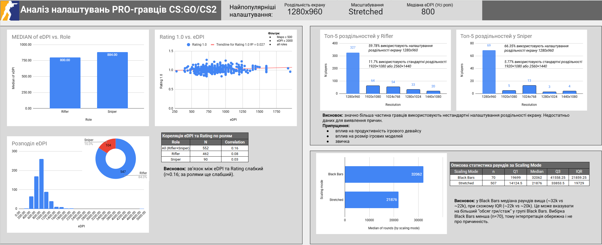

## Google Sheets (view-only)

Повна версія проєкту з усіма таблицями, розрахунками та дашбордом доступна за посиланням:  
https://docs.google.com/spreadsheets/d/1otd8KRAk5ElqTTvsmugGTjlSEJ3xEcaluVVgdjNM61w/edit?gid=1821751720

---

## Project Goal

Метою даного проєкту є аналіз та пошук типових патернів між **ігровими налаштуваннями** та **статистикою ПРО-гравців** у дисципліні **CS / CS2**.

Основний фокус — перевірка можливого зв’язку між параметрами (чутливість, роздільна здатність тощо) та ігровою результативністю.

---

## Data Sources

Дані для аналізу були отримані з публічних джерел:

- **Game settings (CS2)**  
  https://prosettings.net/lists/cs2/

- **Player statistics (HLTV)**  
  https://www.hltv.org/stats/players

Таблиці з сайтів були експортовані за допомогою браузерного розширення **Table Copy**.

---

## Data Processing

- Дані з різних джерел були очищені та приведені до єдиного формату
- Таблиці об’єднані по імені гравця
- Видалені дублі та рядки з некоректними / відсутніми значеннями
- Підготовлений фінальний датасет для аналізу та візуалізації

---

## Key Findings

- **Зв’язок між eDPI та Rating є слабким**  
  (загалом r≈0.16; після поділу за ролями — ще слабший).

- **Sniper мають вищу медіану eDPI, ніж Rifler**  
  (≈884 проти ≈800).

- **Переважна більшість PRO-гравців використовує нестандартну роздільність екрана**  
  (1280×960 — найпопулярніша як для Rifler, так і для Sniper).

- **Стандартні роздільності (1920×1080 / 2560×1440) використовуються значно рідше**,  
  особливо серед Sniper.

- **Гравці з Black Bars мають вищу медіану зіграних раундів**,  
  але вибірка менша, тому висновки щодо причинності є обмеженими.

---

## Dashboard

