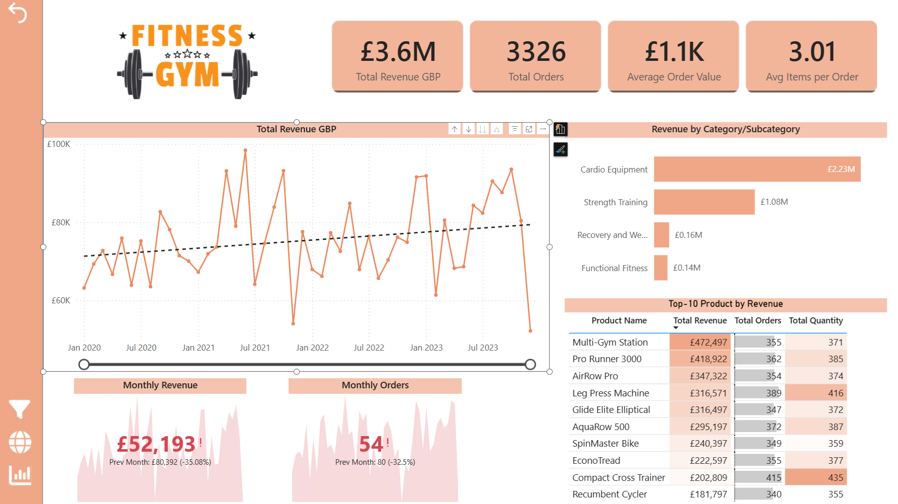
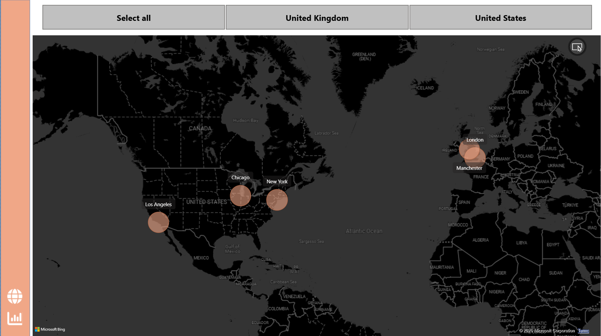
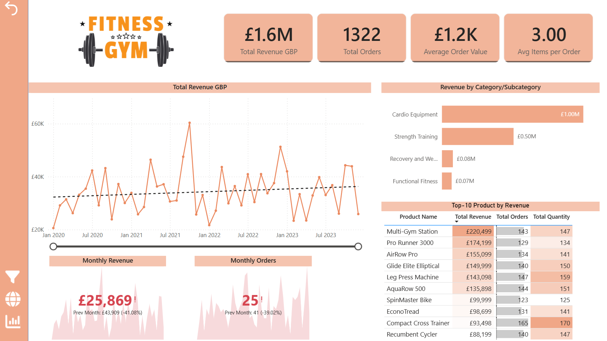
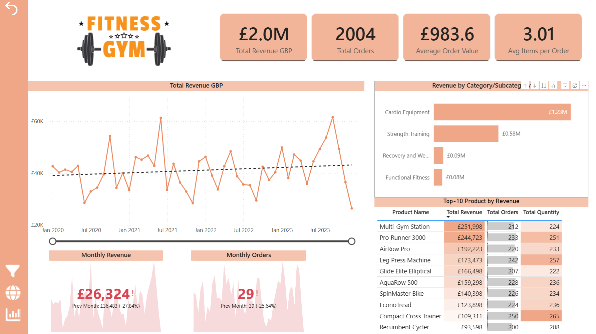
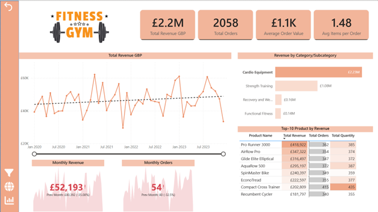
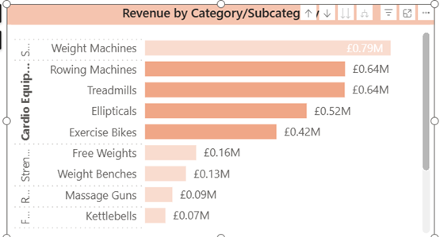
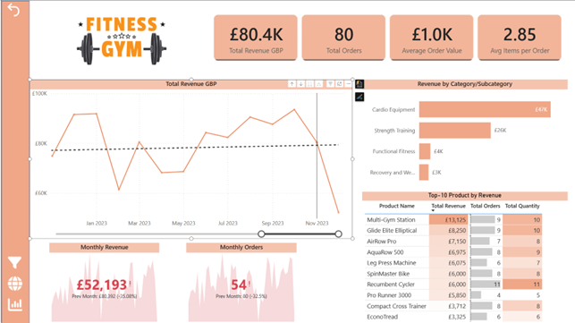
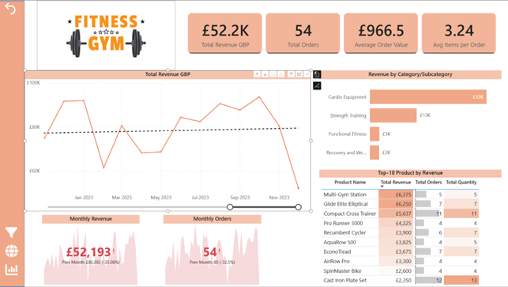
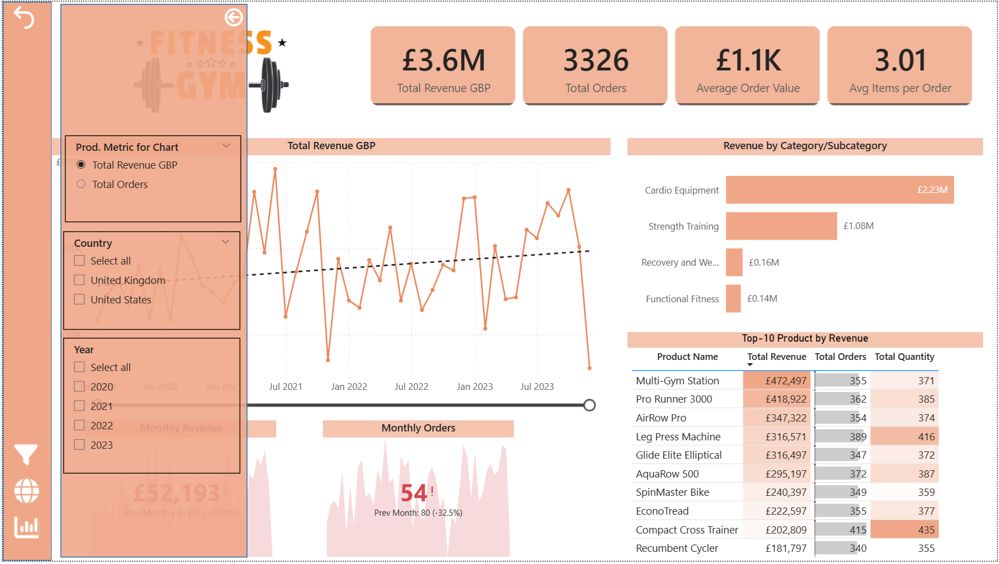

## Аналіз продажів фітнес-обладнання (Power BI)

---

## Опис проєкту

У цьому проєкті було створено інтерактивний дашборд у Power BI для аналізу продажів фітнес-обладнання.

Метою проєкту було:

* побудувати зручний та зрозумілий дашборд для аналізу даних
* дослідити продажі та знайти ключові інсайти
* проаналізувати поведінку клієнтів у різних країнах
* визначити, які категорії та товари приносять найбільшу виручку
* виявити можливі аномалії у динаміці продажів

Аналіз виконано у Power BI з використанням інтерактивних візуалізацій, фільтрів та drill-down.

---

## Джерело даних
Посилання на датасет: https://github.com/mochen862/power-bi-data-modeling/tree/main

Датасет містить інформацію про:

* замовлення
* товари
* магазини
* дати продажів

Основна таблиця: `gym_equipment_sales`

---

## Використані інструменти

* Power BI — візуалізація та аналіз
* Power Query — підготовка даних
* DAX — розрахунок метрик

---

## Технічні навички

### Power BI

* Побудова data model (star schema)
* Стоврення Calculated Field (price GDP)
* Створення measures:
  * Total Revenue GDP
  * Total Orders
  * Total Quantity
  * Average Order Value
  * Avg Items per Order
  * Previuous Month Revenue
  * Previous Month Orders
* Використання slicers (Country, Year)
* Створення Fields Parameter (Product Metric Selection)
* Drill-down (Category → Subcategory)
* Bookmarks та кнопки навігації
* Popup-фільтри
* Edit Interactions

---

## Структура дашборду

Дашборд складається з двох сторінок:

### 1. Overview

* KPI (Revenue, Orders, AOV, Items per Order)
* Динаміка виручки та замовлень у часі
* Аналіз категорій
* Топ продуктів

### 2. Orders & Geography

* Аналіз замовлень
* Мапа продажів
* Додаткові фільтри
  

---

## Аналіз 1: Порівняння ринків (UK vs US)
### Фільтр: UK

### Фільтр: USA

Було проведено порівняння між ринками Великобританії та США.

* США генерує більше замовлень і більшу загальну виручку
* У Великобританії вищий середній чек
* Середня кількість товарів у замовленні майже однакова

Це означає, що:

* у США користувачі купують частіше
* у Великобританії — рідше, але на більшу суму

Також видно, що в обох країнах основну частину виручки приносить категорія Cardio Equipment.

---

## Аналіз 2: Категорії та субкатегорії
### Виділено Cardio Equipment

### Drill-down до сабкатегорій

Аналіз показав, що категорія Cardio Equipment приносить найбільшу частину виручки.

Але при деталізації (drill-down) видно, що:

* у категорії Cardio продажі розподілені між різними товарами
* найбільшою субкатегорією є Weight Machines

Це означає, що:

* Cardio Equipment — стабільна категорія з різними товарами
* Weight Machines — окрема група товарів, яка приносить найбільше виручки

---

## Аналіз 3: Падіння показників у грудні 2023
### Листопад 2023

### Грудень 2023

На графіку видно різке падіння виручки та кількості замовлень у грудні 2023 року.

При цьому:

* у листопаді показники були на нормальному рівні
* падіння відбулося різко
* зниження видно і в revenue, і в orders

Це означає, що:

* спад відбувся саме в грудні
* це не загальний тренд, а окремий випадок

Ймовірно, це пов’язано з сезонністю або іншими факторами.

---

## Висновки

* Поведінка клієнтів відрізняється між країнами (частота покупок vs середній чек)
* Бізнес значною мірою залежить від категорії Cardio Equipment
* Виручка формується як за рахунок широкого набору товарів, так і окремих популярних продуктів
* У кінці періоду спостерігається різке падіння показників, яке потребує додаткового аналізу

---

## Додатково
Для додаткового фільтрування було створене pop-up меню

---
