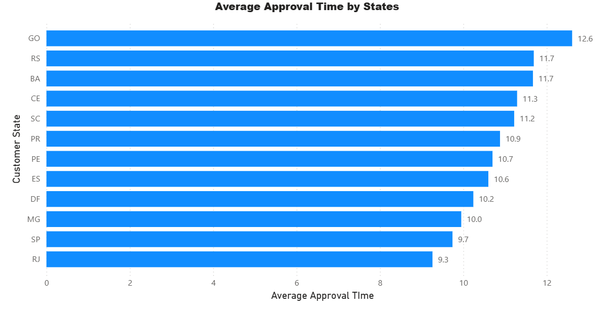
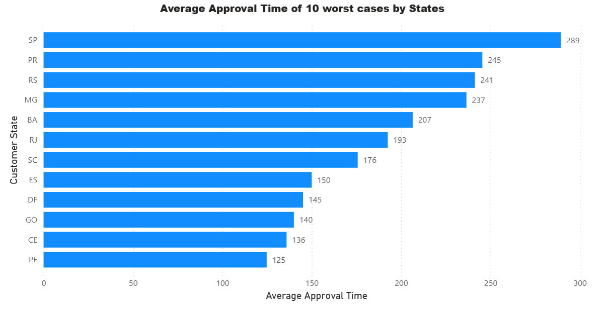
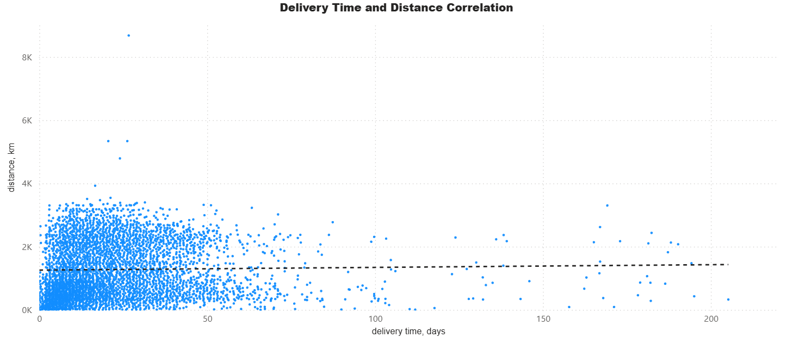
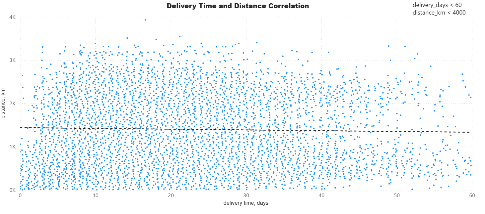
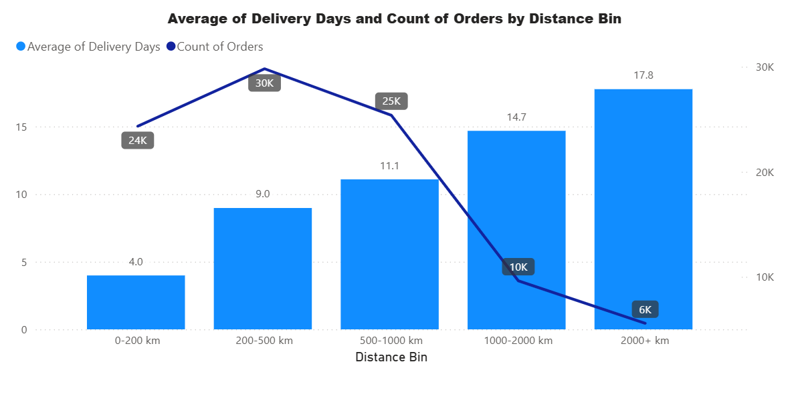

# Аналіз процесу підтвердження замовлень та доставки в e-commerce

## Опис проєкту

У цьому проєкті проведено аналіз процесу підтвердження замовлень та доставки
в e-commerce системі на основі відкритого датасету.

Мета аналізу — дослідити:

- скільки часу займає підтвердження замовлення
- чи є аномалії у процесі підтвердження
- чи впливає відстань між продавцем і покупцем на час доставки

Для аналізу використовувались SQL (PostgreSQL) та Power BI.

---

## Джерело даних

У проєкті використано відкритий датасет:

Brazilian E-Commerce Public Dataset by Olist

Датасет містить інформацію про:

- замовлення
- клієнтів
- продавців
- товари в замовленнях
- геолокацію

Посилання:
https://www.kaggle.com/datasets/olistbr/brazilian-ecommerce

---

## Використані інструменти

- PostgreSQL — обробка та аналіз даних
- Power BI — візуалізація результатів та аналіз даних

---

## Технічні навички

### SQL (PostgreSQL)

- **JOIN операції:** `INNER JOIN`
- **CTE**
- **Window functions:** `RANK() OVER (PARTITION BY ...)`
- **Агрегатні функції:** `AVG()`, `COUNT()`
- **Робота з датами та часом:** `DATE_TRUNC()`, `EXTRACT(EPOCH)`
- **Математичні функції:** `SIN()`, `COS()`, `ASIN()`, `SQRT()`, `POWER()`, `RADIANS()`
- **Групування та фільтрація:** `GROUP BY`, `HAVING`, `WHERE`
- **Очищення даних:** фільтрація `NULL` значень та аномальних записів

### Power BI

- **Scatter Plot** — аналіз кореляції
- **Bar Chart**
- **Line + Column Chart**
- **DAX:** `SWITCH()` для створення бінів відстані (distance bins)
- **Фільтрація даних**

---

## Аналіз 1: Час підтвердження замовлення

### Мета аналізу

Першим етапом було досліджено час між створенням замовлення та його підтвердженням.  
Цей показник дозволяє оцінити ефективність процесу обробки замовлень у системі.

Час підтвердження розраховувався як різниця між:

`order_approved_at - order_purchase_timestamp`

Аналіз проводився на рівні штатів покупців.

### Первинний аналіз

Спочатку було розраховано середній час підтвердження замовлення для кожного штату.

У результаті аналізу було виявлено, що у штаті RR середній час підтвердження значно перевищує інші штати.  
Проте кількість замовлень у цьому штаті є дуже малою, тому навіть декілька аномальних випадків можуть суттєво впливати на середнє значення.

Додатковий аналіз показав, що серед незавершених замовлень у цьому штаті є випадок, де замовлення перебувало у процесі підтвердження понад один місяць.

Можливі причини такої аномалії:

- технічна помилка системи
- відсутність товару
- затримка підтвердження продавцем

Через малу кількість замовлень у цьому штаті один такий випадок суттєво спотворював агреговані показники.

### Середній час підтвердження по штатах

Графік показує, що середній час підтвердження замовлення у більшості штатів знаходиться приблизно в межах 9–12 годин, що свідчить про загалом стабільний процес обробки замовлень.

### Аналіз крайніх випадків

Щоб краще зрозуміти вплив аномальних значень, було проведено додатковий аналіз.

Для кожного штату було визначено 10 найдовших випадків підтвердження замовлення та розраховано їх середній час.  
До аналізу були включені лише штати з понад 1000 замовлень, щоб уникнути впливу малої вибірки.

### Основні висновки

Аналіз показує, що середній час підтвердження замовлення у більшості штатів знаходиться в межах 9–12 годин, що свідчить про стабільний процес обробки замовлень.

Водночас аналіз крайніх випадків показав, що окремі замовлення можуть мати значно довший час підтвердження — понад 200 годин.

Ймовірно, такі значення пов'язані з поодинокими операційними затримками або винятковими ситуаціями.

Це демонструє, що хоча загальна ефективність процесу є стабільною, окремі аномальні випадки можуть суттєво впливати на агреговані показники.

---

## Аналіз 2: Чи впливає відстань на час доставки?

### Мета аналізу

Другим етапом було досліджено, чи існує залежність між відстанню між продавцем і покупцем та часом доставки замовлення.

Для цього було виконано такі кроки:

1. Відібрано завершені замовлення (order_status = 'delivered').
2. Залишено лише замовлення з одним продавцем, щоб уникнути складних маршрутів доставки.
3. Розраховано час доставки як різницю між:
   - передачею замовлення перевізнику (`order_delivered_carrier_date`)
   - доставкою клієнту (`order_delivered_customer_date`)
4. Для zip-кодів клієнтів та продавців визначено приблизні координати (широта та довгота).
5. Відстань між точками розраховано за формулою Haversine.

### Розподіл часу доставки та відстані

Спочатку було побудовано scatter plot для всіх замовлень.

На графіку видно значну варіативність даних та наявність аномальних значень, зокрема:

- замовлення з дуже великим часом доставки
- замовлення з дуже великою відстанню

Такі значення можуть спотворювати аналіз, тому було застосовано фільтр:

- `delivery_days < 60`
- `distance_km < 4000`

### Очищений розподіл даних

Після фільтрації аномалій було побудовано оновлений графік.

Навіть після очищення даних чіткої лінійної залежності між відстанню та часом доставки не спостерігається.  
Кореляція між цими показниками є дуже слабкою.

Це може пояснюватись тим, що на час доставки впливають не лише транспортна відстань, а й інші фактори:

- час обробки замовлення продавцем
- логістичні центри
- робота перевізників
- регіональні особливості доставки

### Агрегований аналіз за діапазонами відстані

Щоб краще зрозуміти загальну тенденцію, замовлення було згруповано за діапазонами відстані:

- 0–200 км
- 200–500 км
- 500–1000 км
- 1000–2000 км
- 2000+ км

Для кожної групи було розраховано:

- середній час доставки
- кількість замовлень

### Основні висновки

Аналіз показує, що на рівні окремих замовлень чіткої кореляції між відстанню та часом доставки майже не спостерігається. Проте після агрегування за діапазонами відстані стає помітною загальна тенденція — зі збільшенням відстані зростає середній час доставки.

Також видно, що найбільша кількість замовлень припадає на відстані 200–1000 км, що свідчить про домінування регіональних доставок.

Таким чином, хоча на рівні окремих спостережень кореляція виглядає слабкою через високий рівень шуму в даних, агрегований аналіз демонструє логічний зв’язок між відстанню та часом доставки.
